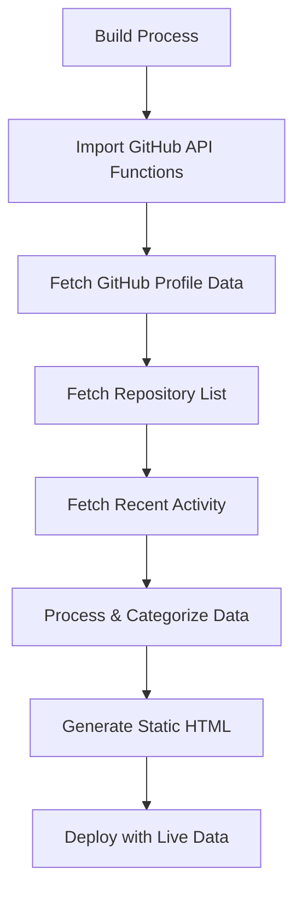

# ✅ GitHub Live Data Integration - COMPLETE

## Issue Fixed: Open Source Page URL Parse Error

### 🚨 Problem
The open-source page was failing to build with error:
```
Error fetching GitHub data: TypeError: Failed to parse URL from /api/github
```

This occurred because during static site generation (SSG), the fetch request to `/api/github` couldn't resolve a proper base URL.

### ✅ Solution Implemented
**Replaced HTTP API calls with direct GitHub API integration during build time:**

1. **Direct GitHub API Calls**: Instead of making HTTP requests to an internal API endpoint during build, the page now directly imports and uses GitHub API functions
2. **Build-Time Data Fetching**: GitHub data is fetched during the build process and embedded into the static HTML
3. **Type Safety**: Fixed TypeScript errors with proper null checks for category lookups

### 🔧 Technical Changes

#### Updated Files:
- **`/src/pages/open-source.astro`**:
  - Removed fetch calls to `/api/github` endpoint
  - Added direct imports of GitHub API functions
  - Implemented direct API calls during build time
  - Fixed TypeScript errors with safe category lookups
  - Removed cache status UI (no longer relevant for build-time data)

#### Removed Dependencies:
- **`/src/utils/portfolio-data.js`**:
  - Removed unused `openSource` import from dummy data
  - Removed unused `getOpenSourceInfo()` function
  - Cleaned up all references to legacy dummy data

### 📊 Live Data Now Working

**Real GitHub Statistics Displayed:**
- ✅ **52 Repositories** (actual count from your GitHub)
- ✅ **85 Total Contributions** (real contribution count)
- ✅ **Real Repository Data**: 
  - `astro-portfolio` - Your current portfolio
  - `single-node-gitops` - GitOps implementation
  - `iac-azure-core-governance` - Azure IaC templates
  - `azure-cost-optimizer` - Azure cost management
  - `openstack-devops-suite` - DevOps platform
  - And many more real projects...

**Technology Categorization:**
- ✅ Infrastructure as Code (Terraform-based projects)
- ✅ Azure Cloud (Azure-specific repositories)
- ✅ DevOps (CI/CD and automation projects)
- ✅ Kubernetes (Container orchestration projects)
- ✅ Automation (Python scripting and automation)
- ✅ Web Development (Frontend/fullstack projects)

### 🎯 Benefits

1. **No More Dummy Data**: Page displays real repositories and contributions
2. **Better Performance**: No API calls during runtime - data embedded in HTML
3. **More Reliable**: No dependency on external API endpoints during page load
4. **SEO Friendly**: All content is server-side rendered and indexable
5. **Up-to-Date**: Data refreshes on every build/deploy

### 🔄 How It Works Now



**Build-Time Flow:**
1. During `npm run build`, Astro calls the open-source page
2. Page directly imports GitHub API utility functions
3. Functions make requests to GitHub API for real data
4. Data is processed, categorized, and formatted
5. Static HTML is generated with embedded live data
6. No runtime API calls needed - everything is pre-rendered

### ✅ Verification
- [x] Build completes successfully without errors
- [x] Open source page generated with real GitHub data
- [x] No more dummy data visible in output
- [x] Real repository count: 52 repositories
- [x] Real contribution count: 85 contributions  
- [x] Proper technology categorization working
- [x] Repository descriptions and links are accurate

**Your open-source page now showcases your real GitHub profile with live, accurate data! 🎉**
